# Proyek Akhir: Menyelesaikan Permasalahan Institusi Pendidikan

## Kartu Skor Risiko Dropout Mahasiswa Jaya Jaya Institut

| | |
|---|---|
| **Nama** | Dimas Naufal Djatmiko |
| **ID Dicoding** | dimas_naufal_djamiko |
| **Kelas** | Belajar Penerapan Data Science |
| **Pendekatan** | Kartu skor berbasis Weight of Evidence, ditambah segmentasi profil mahasiswa berisiko |
| **Kartu** | 10 variabel, 50 pita, skor dasar 600 dengan PDO 20 |
| **Dashboard** | Papan Pantau Kartu Skor Retensi (Metabase, 17 visualisasi, 4 penyaring) |

---

## Business Understanding

Jaya Jaya Institut adalah perguruan tinggi yang berdiri sejak tahun 2000 dan sudah
meluluskan banyak alumni dengan reputasi baik. Meski begitu, cukup banyak mahasiswa yang
berhenti di tengah jalan atau dropout. Manajemen ingin mendeteksi sedini mungkin
mahasiswa yang berpotensi berhenti supaya mereka dapat diberi bimbingan khusus.

### Mengapa proyek ini berbentuk kartu skor

Sebuah model yang akurat belum tentu terpakai. Bimbingan bukan proses otomatis: ia
berujung pada seorang dosen wali yang duduk berhadapan dengan mahasiswanya. Pada
percakapan itu, kalimat "sistem menghitung peluang Anda berhenti sebesar 0,71" tidak
membantu siapa pun. Yang membantu adalah kalimat seperti "skor Anda 512, dan yang paling
menekan skor itu adalah tunggakan uang kuliah sebesar minus 38 poin serta jumlah mata
kuliah lulus semester dua sebesar minus 24 poin".

Karena itu proyek ini memakai metode kartu skor, pendekatan yang lazim dipakai lembaga
keuangan untuk menilai risiko kredit dan di sini dipindahkan ke ranah pendidikan. Hasil
akhirnya bukan sekadar model, melainkan tabel poin yang dapat dicetak, ditempel di ruang
dosen wali, dan dihitung dengan tangan tanpa komputer.

Konsekuensinya diterima sejak awal: kartu skor sedikit kalah tajam dibanding model kotak
hitam. Bagian Evaluation mengukur persis berapa besar selisih itu, supaya keputusan
memilih transparansi diambil dengan angka, bukan dengan selera.

### Permasalahan Bisnis

1. Institusi belum mengetahui variabel mana yang benar benar menentukan mahasiswa
   berhenti studi, dan seberapa besar sumbangan masing masing.
2. Institusi tidak dapat menyebut siapa yang berisiko sebelum mahasiswa benar benar
   pergi, sehingga bimbingan selalu datang terlambat.
3. Hasil penilaian harus dapat dijelaskan kepada mahasiswa. Penilaian yang tidak dapat
   dijelaskan tidak akan dipercaya, dan akhirnya tidak dipakai.
4. Mahasiswa berisiko tidak menghadapi masalah yang seragam. Sebagian terhalang biaya,
   sebagian kesulitan mengikuti perkuliahan, sebagian lagi sudah berhenti hadir. Satu
   bentuk bantuan yang sama untuk semua akan meleset pada sebagian besar dari mereka.
5. Institusi belum memiliki alat pantau mandiri untuk melihat sebaran risiko tanpa
   meminta laporan baru ke bagian akademik.

### Cakupan Proyek

1. Menjalankan seluruh tahapan proyek data science, dari business understanding sampai
   deployment prototipe ke Streamlit Community Cloud.
2. Mengukur kekuatan setiap variabel memakai Information Value, lalu membagi setiap
   variabel menjadi pita yang bermakna dan searah.
3. Menyusun kartu skor lengkap dengan poin per pita, ambang keputusan, dan peringkat
   huruf A sampai E.
4. Membandingkan kartu skor dengan model kotak hitam untuk mengukur harga transparansi.
5. Mengelompokkan mahasiswa berisiko menjadi beberapa profil agar bentuk bantuannya
   dapat dibedakan.
6. Membangun business dashboard Metabase dan prototipe Streamlit berupa kalkulator kartu
   skor.

### Persiapan

**Sumber data.** Berkas `dataset/data.csv` diambil apa adanya dari repositori dataset
Dicoding pada alamat
<https://github.com/dicodingacademy/dicoding_dataset/tree/main/students_performance>.
Isinya 4.424 baris dengan 37 kolom, memakai titik koma sebagai pemisah, dan sudah bersih
sejak awal: tidak satu pun sel kosong, tidak ada baris kembar.

**Menyiapkan lingkungan.**

```bash
# 1. Buat dan aktifkan virtual environment, Python 3.12
python -m venv venv
venv\Scripts\activate           # Windows
# source venv/bin/activate      # Linux atau macOS

# 2. Pasang seluruh dependensi proyek
pip install -r requirements.txt

# 3. Tambahan khusus untuk menjalankan ulang notebook
pip install jupyter ipykernel

# 4. Jalankan notebook
jupyter notebook notebook.ipynb
```

**Struktur berkas submission.**

```
submission
├── model
│   ├── mesin_kartu_skor.joblib   pembagi pita, kartu poin, pengelompok profil
│   ├── kartu_skor.csv            tabel poin siap cetak
│   └── metadata_kartu.json       ambang, metrik, information value, profil
├── dataset
│   ├── data.csv                      dataset asli dari repositori Dicoding
│   ├── mahasiswa_aktif.csv           794 mahasiswa berstatus aktif
│   ├── mahasiswa_aktif_berskor.csv   mahasiswa aktif beserta skor dan profilnya
│   └── mahasiswa_berskor.csv         seluruh mahasiswa berskor, sumber dashboard
├── assets                               grafik notebook dan tangkapan layar prototipe
├── notebook.ipynb                       seluruh proses data science, sudah dijalankan
├── app.py                               prototipe kalkulator kartu skor
├── kartu_skor.py                        mesin pita WOE dan penyusun kartu
├── label_pita.py                        penerjemah kode dataset menjadi label Indonesia
├── akademik_dimas.db                    basis data SQLite sumber dashboard
├── metabase.db.mv.db                    instance Metabase berisi dashboard
├── dimas_naufal_djamiko-dashboard.png   tangkapan layar dashboard
├── dimas_naufal_djamiko-video.mp4       video presentasi singkat
├── requirements.txt
└── README.md
```

---

## Data Understanding

Setiap baris mewakili satu mahasiswa yang pernah terdaftar, dengan 36 kolom masukan dan
satu kolom `Status` berisi hasil akhirnya. Kolom masukan berasal dari lima sumber
pencatatan yang berbeda di dalam institusi.

| Sumber pencatatan | Isi | Jumlah kolom |
|---|---|---|
| Berkas pendaftaran | Jalur masuk, urutan pilihan, program studi, waktu kuliah, ijazah terakhir, nilai seleksi | 7 |
| Data pribadi | Usia, jenis kelamin, status pernikahan, kewarganegaraan, tempat tinggal, kebutuhan khusus | 7 |
| Data keluarga | Pendidikan dan pekerjaan kedua orang tua | 4 |
| Bagian keuangan | Tunggakan, kelancaran uang kuliah, beasiswa | 3 |
| Sistem akademik | Mata kuliah diambil, diujikan, lulus, alih kredit, tanpa ujian, dan nilai rata rata dua semester | 12 |
| Statistik nasional | Pengangguran, inflasi, pertumbuhan ekonomi | 3 |

Sebaran status akhir mahasiswa:

| Status | Jumlah | Persen | Keterangan |
|---|---|---|---|
| Graduate | 2.209 | 49,9 persen | sudah lulus |
| Dropout | 1.421 | 32,1 persen | berhenti sebelum lulus |
| Enrolled | 794 | 17,9 persen | masih berkuliah |

Kelompok `Enrolled` **dikeluarkan dari pelatihan** karena hasil akhirnya belum ada.
Melatih model dengan label yang belum diketahui berarti mengajarinya menebak. Mereka
disimpan terpisah lalu diberi skor pada bagian tersendiri, dan justru merekalah sasaran
akhir sistem ini.

---

## Exploratory Data Analysis lewat Information Value

Penjelajahan data pada proyek ini tidak dimulai dari grafik satu per satu, melainkan dari
satu ukuran yang dapat membandingkan seluruh variabel dalam satuan yang sama.

Setiap variabel dibagi menjadi pita. Untuk tiap pita dihitung berapa bagian mahasiswa
selamat dan berapa bagian mahasiswa berhenti yang jatuh ke dalamnya. Ketimpangan itu
disebut Weight of Evidence, dan penjumlahan sumbangannya menghasilkan Information Value
satu variabel.

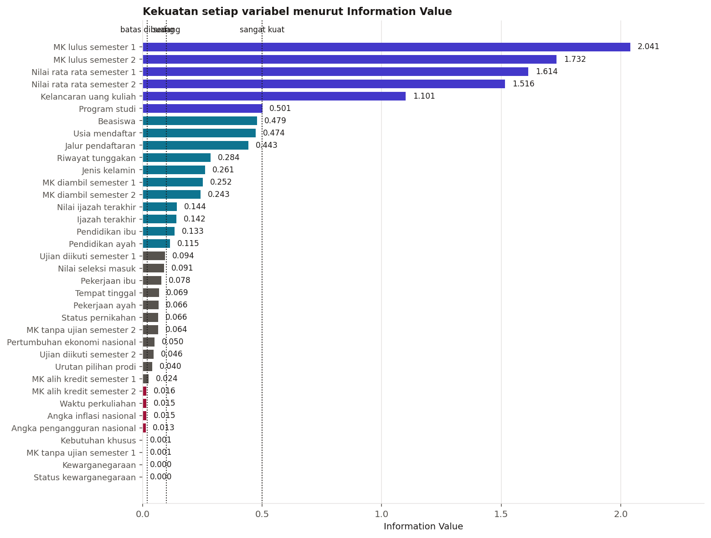

**Empat variabel teratas seluruhnya berasal dari sistem akademik**, yaitu jumlah mata
kuliah lulus dan nilai rata rata dua semester pertama, dengan IV antara 1,5 dan 2,0. Di
bawahnya, kelancaran uang kuliah mencapai 1,10 sebagai satu satunya variabel non akademik
yang tergolong sangat kuat.

Delapan variabel berada di bawah batas 0,02 dan dibuang: dua kolom alih kredit, mata
kuliah tanpa ujian semester satu, waktu perkuliahan, kebutuhan khusus, kewarganegaraan,
serta ketiga statistik nasional. Kolom statistik nasional memang tidak mungkin membedakan
mahasiswa, karena nilainya sama untuk semua orang pada tahun yang sama.

Seluruh persentase pada bagian ini dihitung pada 2.904 mahasiswa data latih yang hasil
akhirnya sudah diketahui, sehingga wajar bila terlihat lebih tinggi daripada angka 32,1
persen pada tabel sebelumnya.

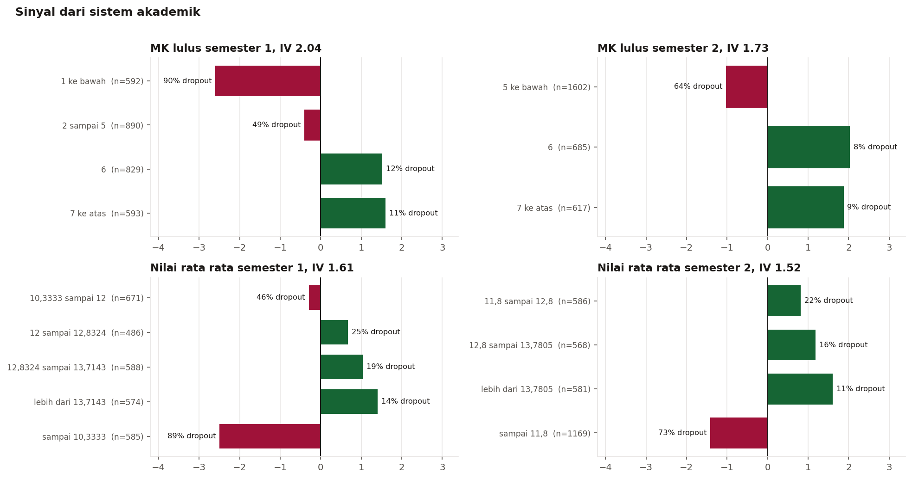

Mahasiswa yang meluluskan paling banyak satu mata kuliah pada semester pertama berakhir
berhenti pada 89,7 persen kasus. Begitu jumlah kelulusan mencapai enam mata kuliah,
angkanya jatuh ke 12,3 persen. Batas pemisah terkuat ternyata bukan di angka nol,
melainkan di sekitar lima sampai enam mata kuliah lulus per semester, dan kelompok
separuh jalan itulah yang paling mungkin diselamatkan.

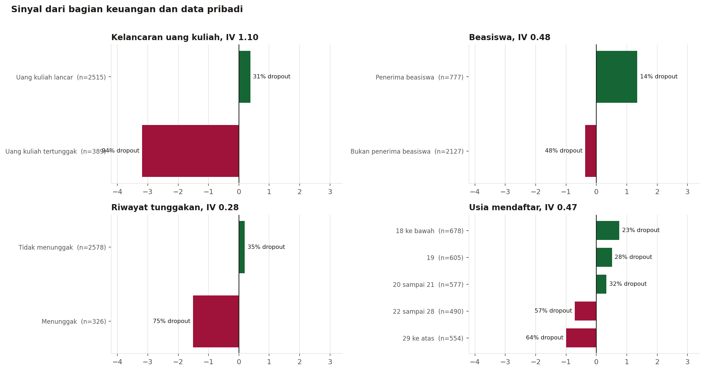

Mahasiswa dengan uang kuliah tertunggak berakhir berhenti pada 94,1 persen kasus,
dibanding 30,7 persen pada yang lancar. Beasiswa bergerak ke arah sebaliknya, dari 48,2
persen menjadi 14,3 persen. Usia mendaftar naik bertahap sampai kelompok 20 sampai 21
tahun, lalu melonjak ke 56,7 persen pada kelompok 22 sampai 28 tahun.

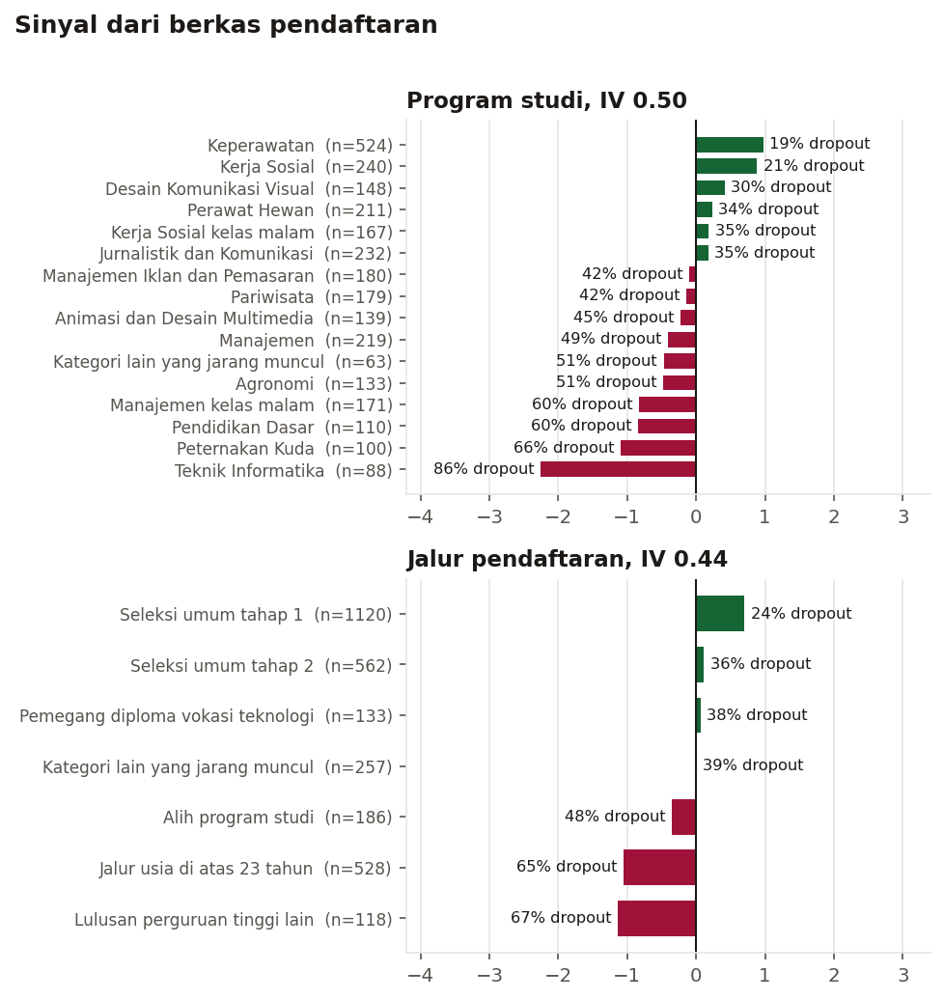

Keperawatan pada 19,5 persen dan Kerja Sosial pada 20,8 persen berada di ujung teraman,
sementara Teknik Informatika pada 86,4 persen dan Peternakan Kuda pada 66,0 persen berada
di ujung sebaliknya.

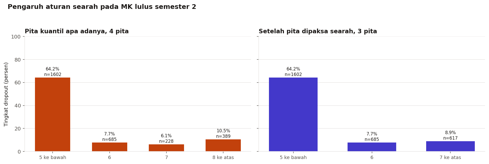

Pembagian kuantil apa adanya menghasilkan pita yang berbalik arah, misalnya kelompok
tujuh mata kuliah lulus tercatat sedikit lebih berisiko daripada kelompok delapan ke
atas. Selisih itu hanya riak sampel, tetapi kalau dibiarkan masuk kartu, ia muncul sebagai
baris yang mustahil dijelaskan kepada mahasiswa. Setelah pita bertetangga yang berbalik
arah digabung, seluruh variabel angka bergerak satu arah.

---

## Modeling: dari Regresi Logistik menjadi Kartu Skor

### Tiga saringan variabel

| Saringan | Aturan | Hasil |
|---|---|---|
| Kekuatan | Information Value di bawah 0,02 dibuang | 8 variabel keluar |
| Kepatutan | Variabel yang tidak patut dipakai menilai perorangan dibuang | 1 variabel keluar, yaitu jenis kelamin |
| Keringkasan | Diambil 12 teratas menurut Information Value | tersisa 12 calon |

Jenis kelamin memiliki IV 0,26, cukup untuk lolos saringan pertama, tetapi memakainya
berarti institusi memberi poin risiko kepada seseorang karena hal yang tidak dapat ia
ubah dan tidak dapat ia perbaiki lewat bimbingan apa pun. Selisih tingkat dropout antar
jenis kelamin tetap penting untuk diketahui saat merancang program bimbingan, tetapi
tempatnya bukan di dalam kartu skor perorangan.

### Memeriksa arah koefisien

Regresi logistik dilatih di atas nilai WOE. Karena WOE tinggi berarti pita yang lebih
aman, seluruh koefisien seharusnya negatif. Dua variabel keluar dengan tanda berlawanan,
yaitu jumlah mata kuliah yang diambil pada kedua semester, dan keduanya dibuang.
Penyebabnya dapat ditebak: jumlah mata kuliah diambil dan jumlah yang lulus bergerak
beriringan, sehingga salah satunya berbalik tanda ketika keduanya masuk model bersama.

Kartu akhir berisi **10 variabel dan 50 pita**.

### Menerjemahkan koefisien menjadi poin

```
faktor = pdo / ln(2)
offset = skor_dasar - faktor * ln(odds_dasar)
poin   = -(koefisien * WOE + intersep / n) * faktor + offset / n
```

Skor dasar ditetapkan 600 pada odds satu banding satu, dan PDO 20. Artinya mahasiswa
berskor 600 memiliki peluang selamat dan peluang berhenti yang sama besar, dan setiap
tambahan 20 poin melipatduakan perbandingan tersebut.

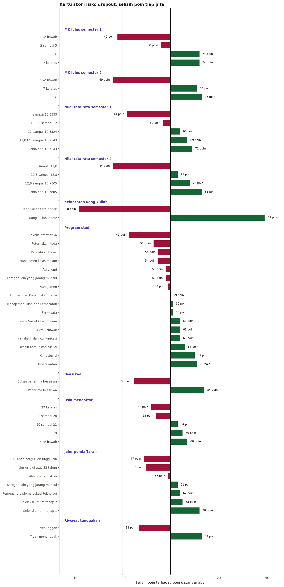

Pita paling menghukum adalah uang kuliah tertunggak dengan minus 38 poin, disusul
kelulusan lima mata kuliah ke bawah pada semester dua dan nilai rata rata semester dua di
bawah 11,8, keduanya minus 24 poin. Pita paling menolong adalah uang kuliah yang lancar
dengan tambahan 39 poin, status penerima beasiswa dengan 14 poin, dan kelulusan enam mata
kuliah semester dua dengan 13 poin.

---

## Evaluation

### Sebaran skor dan ambang keputusan

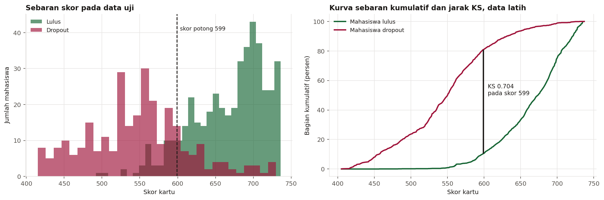

Ambang keputusan dipilih memakai statistik Kolmogorov Smirnov, ukuran baku pada dunia
kartu skor, yaitu jarak vertikal terbesar antara sebaran kumulatif kelompok selamat dan
kelompok berhenti. Nilainya dihitung pada data latih supaya data uji tetap murni.

Hasilnya **KS 0,704 pada skor potong 599**, hampir persis di skor dasar 600 yang memang
dirancang sebagai titik peluang seimbang. Mahasiswa berskor di bawah 599 lebih mungkin
berhenti daripada bertahan.

### Peringkat huruf

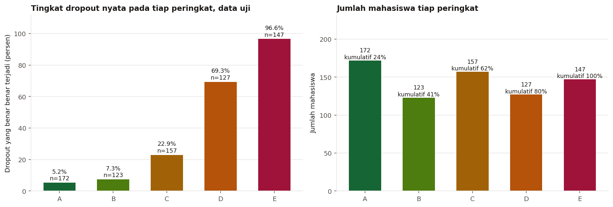

| Peringkat | Rentang skor | Jumlah di data uji | Bagian | Berhenti nyata |
|---|---|---|---|---|
| A | 695 ke atas | 172 | 23,7 persen | 5,2 persen |
| B | 657 sampai 694 | 123 | 16,9 persen | 7,3 persen |
| C | 599 sampai 656 | 157 | 21,6 persen | 22,9 persen |
| D | 550 sampai 598 | 127 | 17,5 persen | 69,3 persen |
| E | di bawah 550 | 147 | 20,2 persen | 96,6 persen |

Batas antara C dan D ditetapkan tepat pada skor potong KS, sehingga seluruh mahasiswa
berperingkat D dan E adalah mereka yang dipanggil sistem. Peringkat C berada di wilayah
abu abu dan justru menarik secara operasional: mereka belum dipanggil, tetapi satu dari
empat di antaranya akan berhenti.

### Ukuran kemampuan kartu pada data uji

| Ukuran | Nilai |
|---|---|
| ROC-AUC | 0,9202 |
| Statistik KS pada data latih | 0,7044 |
| Akurasi pada skor potong | 0,8650 |
| Presisi | 0,8394 |
| Recall | 0,8099 |
| F1 | 0,8244 |

Validasi silang lima lipatan pada data latih menghasilkan ROC-AUC 0,9239 dengan simpangan
baku 0,0090. Pembagian pita dan nilai WOE dipelajari ulang di dalam tiap lipatan, sehingga
angka itu tidak tercemar kebocoran.

### Keuntungan kumulatif

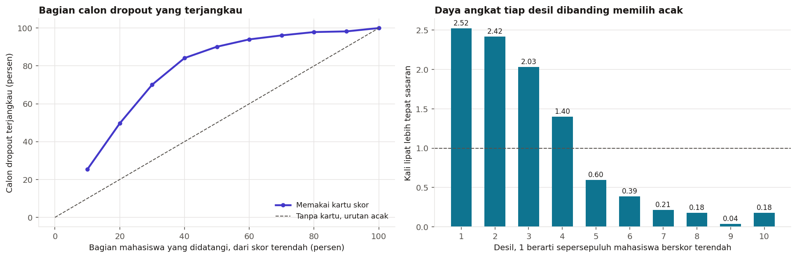

| Bagian mahasiswa didatangi | Calon dropout terjangkau | Ketepatan desil | Daya angkat |
|---|---|---|---|
| 10 persen berskor terendah | 25,4 persen | 98,6 persen | 2,52 kali |
| 20 persen berskor terendah | 49,6 persen | 94,5 persen | 2,42 kali |
| 30 persen berskor terendah | 70,1 persen | 79,5 persen | 2,03 kali |
| 40 persen berskor terendah | 84,2 persen | 54,8 persen | 1,40 kali |

Sesudah desil keempat kurva mulai mendatar. Menambah kapasitas bimbingan melampaui empat
puluh persen mahasiswa memberi tambahan hasil yang semakin kecil, dan titik jenuh itu
dapat ditunjukkan dengan angka ketika biro kemahasiswaan menyusun anggaran.

### Berapa harga transparansi

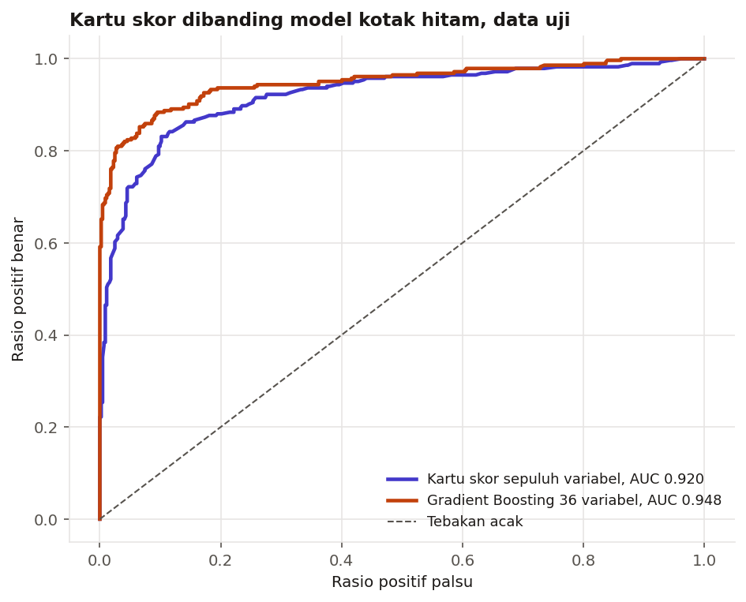

| Ukuran | Kartu skor | Gradient Boosting |
|---|---|---|
| ROC-AUC | 0,9202 | 0,9484 |
| Jumlah variabel | 10 | 36 |
| Dapat dihitung dengan tangan | ya | tidak |
| Alasan tiap poin dapat ditunjukkan | ya | tidak |

Selisihnya **0,0282 poin ROC-AUC**. Untuk membeli selisih sekecil itu, institusi harus
menyerahkan tiga hal yang justru menjadi syarat sistem ini terpakai: kemampuan
menjelaskan, kemampuan berjalan tanpa perangkat, dan kemampuan diperiksa oleh bagian
akademik baris demi baris.

---

## Segmentasi Profil Mahasiswa Berisiko

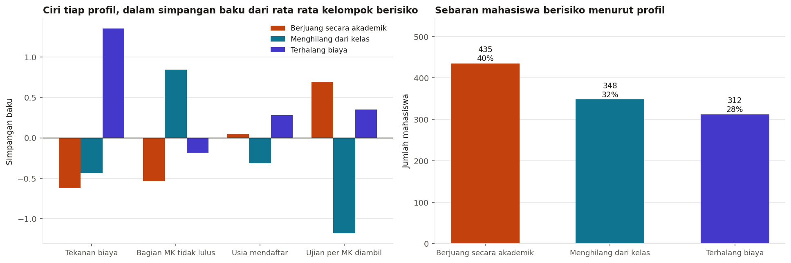

Kartu skor menjawab siapa yang perlu dibimbing, tetapi tidak menjawab bimbingan seperti
apa. Mahasiswa berperingkat D dan E dikelompokkan memakai KMeans di atas empat sumbu yang
masing masing mewakili satu jenis masalah: tekanan biaya, kesulitan akademik, usia masuk,
dan kehadiran ujian.

| Profil | Jumlah di data latih | Ciri utama | Bentuk bantuan |
|---|---|---|---|
| Berjuang secara akademik | 435 | Tetap hadir dan ikut ujian, tetapi separuh mata kuliah tidak lulus | Asistensi mata kuliah, pengurangan beban lewat kontrak studi, mentor belajar |
| Menghilang dari kelas | 348 | Nyaris tidak mengikuti ujian sama sekali | Dihubungi lewat telepon pekan itu juga, cari penyebab sebelum membicarakan nilai, tawarkan cuti terencana |
| Terhalang biaya | 312 | Tekanan biaya jauh di atas kelompok lain, usia rata rata paling tinggi | Skema cicilan atau keringanan, pendataan beasiswa susulan |

Pengelompokan ini adalah alat bantu percakapan, bukan label permanen. Skor silhouette
tergolong sedang, artinya batas antar kelompok tidak tegas dan sebagian mahasiswa berada
di perbatasan.

---

## Penerapan pada Mahasiswa yang Masih Aktif

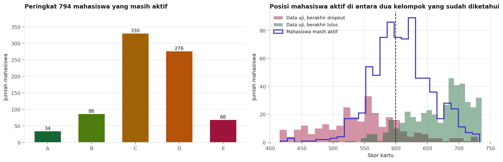

Dari 794 mahasiswa aktif, kartu menempatkan **344 orang atau 43,3 persen pada peringkat D
dan E**. Di antara mereka, 263 orang tergolong berjuang secara akademik, 49 orang
menghilang dari kelas, dan 32 orang terhalang biaya.

Rata rata skor kelompok aktif adalah 608, berada di antara 548 pada kelompok yang berhenti
dan 666 pada kelompok yang lulus. Bentuk sebaran seperti ini masuk akal, karena kelompok
aktif memang campuran antara mahasiswa yang akan selesai dan mahasiswa yang sedang menuju
berhenti.

Hasil lengkapnya tersimpan pada `dataset/mahasiswa_aktif_berskor.csv`.

---

## Business Dashboard

Dashboard **Papan Pantau Kartu Skor Retensi** dibangun di Metabase dan berisi **17
visualisasi** dalam empat seksi, dengan **4 penyaring interaktif**: program studi,
peringkat kartu skor, profil mahasiswa berisiko, dan asal data.

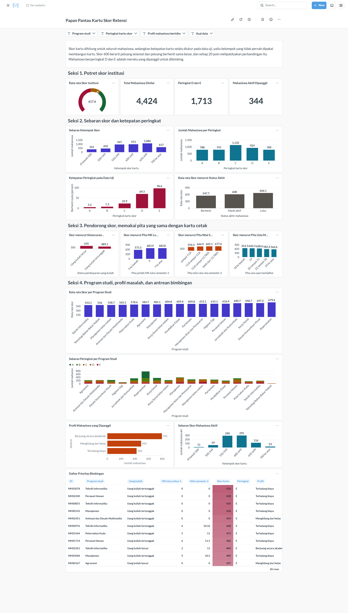

| Seksi | Isi | Pertanyaan yang dijawab |
|---|---|---|
| 1. Potret skor institusi | Rata rata skor, total mahasiswa, jumlah peringkat D dan E, mahasiswa aktif yang dipanggil | Seberapa sehat angkatan ini menurut kartu |
| 2. Sebaran skor dan ketepatan peringkat | Sebaran kelompok skor, jumlah per peringkat, ketepatan peringkat pada data uji, rata rata skor per status | Apakah kartu benar benar memisahkan |
| 3. Pendorong skor | Skor menurut kelancaran uang kuliah, pita mata kuliah lulus, pita nilai, dan pita usia | Variabel mana yang paling menggerakkan skor |
| 4. Program studi, profil, antrean | Skor per program studi, sebaran peringkat per program, profil mahasiswa yang dipanggil, sebaran skor mahasiswa aktif, daftar prioritas | Siapa yang harus dipanggil lebih dulu dan dengan bantuan seperti apa |

Pita pada seksi 3 disusun persis seperti pita pada kartu cetak, sehingga grafik dashboard
dan baris kartu berbicara tentang kelompok yang sama. Ketepatan kartu selalu diukur pada
data uji, kelompok yang tidak pernah dipakai membangun kartu.

### Menjalankan dashboard

Kredensial masuk Metabase:

| | |
|---|---|
| **Email** | `root@mail.com` |
| **Password** | `root123` |

**Cara pertama, memakai Docker.** Jalankan dari dalam folder submission ini, karena folder
inilah yang berisi `metabase.db.mv.db` dan `akademik_dimas.db`.

```bash
docker run -d -p 3000:3000 --name metabase \
  -v "$PWD/metabase.db.mv.db:/metabase.db/metabase.db.mv.db" \
  -v "$PWD/akademik_dimas.db:/akademik_dimas.db" \
  -v "$PWD/akademik_dimas.db:/app/akademik_dimas.db" \
  -e MB_DB_FILE=/metabase.db/metabase.db \
  metabase/metabase
```

Begitu baris `Metabase Initialization COMPLETE` muncul di log, buka
<http://localhost:3000> lalu masuk dengan kredensial di atas. Dashboard berada di menu
Collections.

**Cara kedua, tanpa Docker.** Ambil `metabase.jar` di
<https://www.metabase.com/start/oss/jar>, siapkan Java 21, lalu jalankan perintah berikut
**dengan posisi terminal berada di dalam folder submission**:

```bash
set MB_DB_TYPE=h2
set MB_DB_FILE=metabase.db
java -jar path\ke\metabase.jar
```

Working directory harus folder submission, karena koneksi basis data memakai path relatif
`akademik_dimas.db`. Menjalankannya dari folder lain membuat kartu dashboard gagal memuat
data.

---

## Menjalankan Sistem Machine Learning

Prototipe adalah bentuk digital dari kartu skor cetak. Staf memilih pita yang sesuai untuk
setiap variabel, poin dijumlahkan, lalu totalnya diterjemahkan menjadi peringkat huruf dan
peluang. Tidak ada perhitungan tersembunyi.

| Ruang kerja | Kegunaan |
|---|---|
| **Hitung kartu skor** | Menilai satu mahasiswa lewat pilihan pita, lengkap dengan rincian poin, peringkat, peluang, profil masalah, dan saran tindak lanjut |
| **Antrean prioritas** | Menilai satu berkas CSV, menetapkan kapasitas konselor, lalu memperoleh antrean yang siap dijadwalkan dan diunduh |
| **Kartu skor lengkap** | Seluruh tabel poin, siap dicetak dan diunduh sebagai CSV |
| **Cara kerja** | Ringkasan metode, ukuran kemampuan, harga transparansi, dan batasan pemakaian |

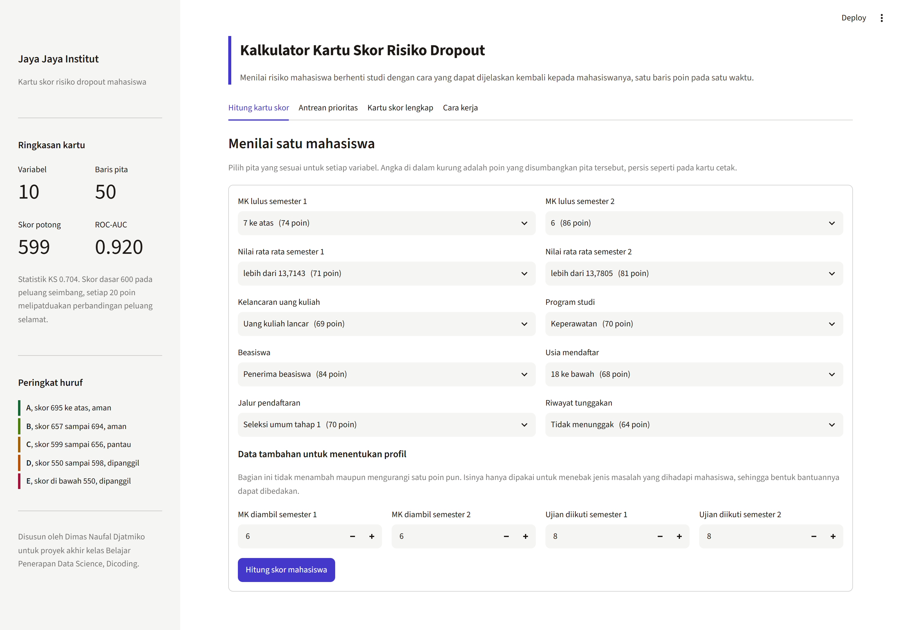

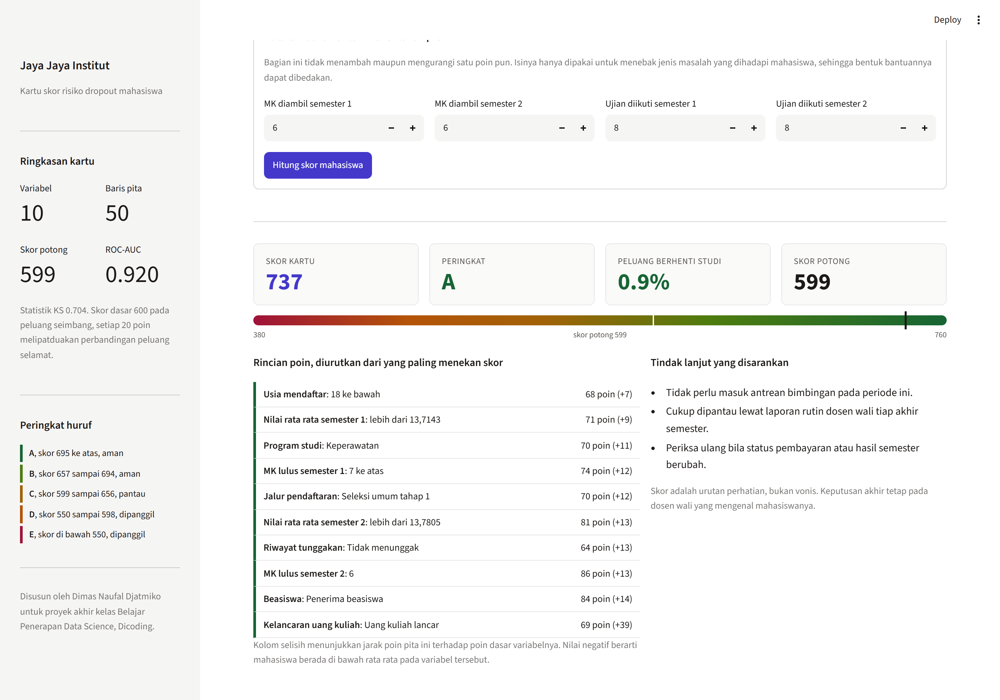

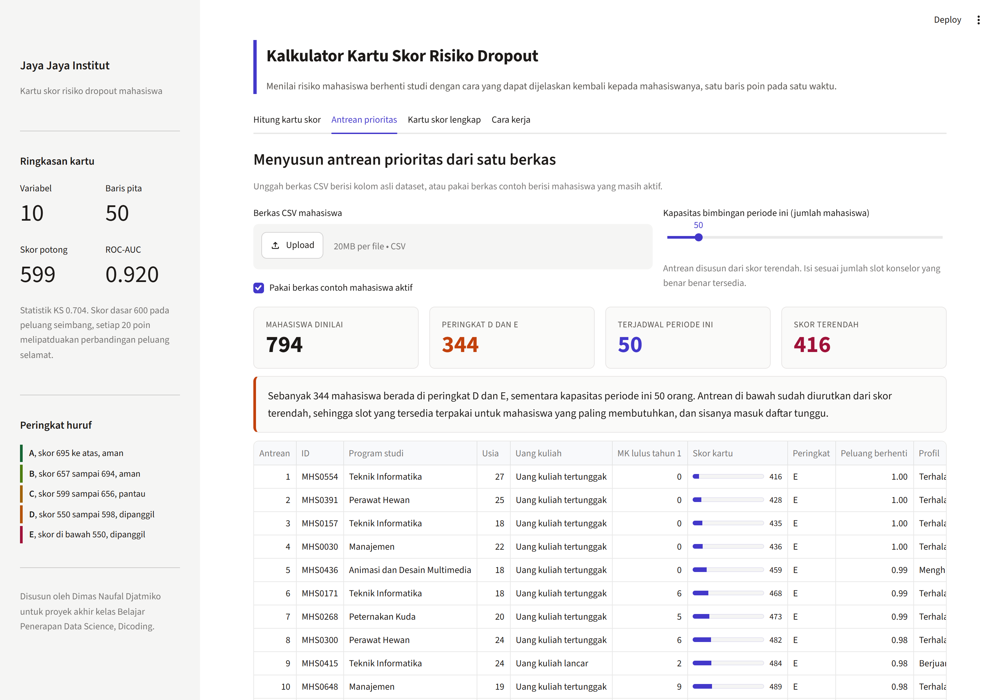

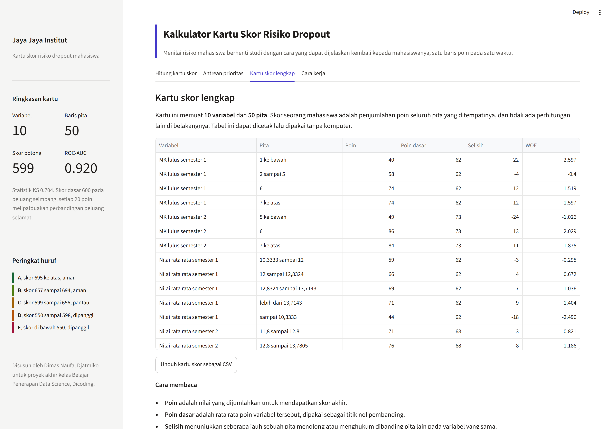

### Menjalankan secara lokal

```bash
pip install -r requirements.txt
streamlit run app.py
```

Aplikasi terbuka di <http://localhost:8501>. Tab antrean prioritas dapat langsung dicoba
tanpa mengunggah apa pun, karena berkas contoh berisi 794 mahasiswa yang masih aktif ikut
disertakan di dalam folder dataset.

### Menjalankan di Streamlit Community Cloud

Tautan prototipe: **<PLACEHOLDER_URL_STREAMLIT>**

Langkah penyebarannya:

1. Salin isi folder `submission` ke repositori GitHub publik. Dua berkas basis data,
   yaitu `metabase.db.mv.db` dan `akademik_dimas.db`, dapat ditinggalkan karena hanya
   dipakai dashboard. Keduanya sudah tercantum pada `.gitignore`.
2. Masuk ke <https://share.streamlit.io> memakai akun GitHub yang sama.
3. Pilih **Create app**, arahkan ke repositori tersebut, isi `app.py` sebagai main file
   path, lalu tekan **Deploy**.
4. Streamlit Community Cloud membaca `requirements.txt` secara otomatis.

Berkas yang wajib ikut ter-deploy: `app.py`, `kartu_skor.py`, `label_pita.py`, folder
`model`, folder `dataset`, dan `requirements.txt`. Modul `kartu_skor.py` wajib ada karena
berkas mesin kartu menyimpan referensi ke kelas `PitaWOE` di dalamnya.

---

## Conclusion

**1. Variabel mana yang benar benar menentukan, dan seberapa besar.**

Information Value memberi peringkat yang tegas. Empat variabel teratas seluruhnya berasal
dari sistem akademik dengan IV antara 1,5 dan 2,0, disusul kelancaran uang kuliah pada
1,10, lalu program studi, beasiswa, usia mendaftar, dan jalur pendaftaran. Delapan
variabel terbukti tidak berguna dan dibuang, termasuk ketiga statistik nasional.

Lebih penting daripada peringkat itu, kartu skor menyatakan besar sumbangannya dalam
satuan yang sama, yaitu poin. Uang kuliah tertunggak menghapus 38 poin, sementara
sebagian besar variabel lain hanya menggeser beberapa poin.

**2. Apakah mahasiswa berisiko dapat dikenali sebelum berhenti.**

Bisa. Kartu skor sepuluh variabel mencapai ROC-AUC 0,920 dengan statistik KS 0,704 pada
726 mahasiswa data uji yang belum pernah dilihat. Sepersepuluh mahasiswa berskor terendah
hampir seluruhnya benar benar berhenti, dan dua desil pertama sudah menjangkau separuh
seluruh calon dropout.

**3. Apakah hasilnya dapat dijelaskan kepada mahasiswa.**

Inilah yang membedakan pendekatan ini. Setiap skor dapat dipecah menjadi baris poin yang
dapat ditunjukkan. Model Gradient Boosting yang dilatih pada data yang sama memang lebih
unggul, tetapi hanya 0,0282 poin ROC-AUC, dan keunggulan itu ditukar dengan hilangnya
seluruh kemampuan menjelaskan.

**4. Apakah bentuk bantuannya dapat dibedakan.**

Bisa. Mahasiswa berperingkat D dan E terbagi menjadi tiga profil yang berbeda sumbu
masalahnya, masing masing dengan tiga tindakan yang berbeda pula.

**5. Alat pantau mandiri.**

Dashboard Metabase dengan 17 visualisasi dan 4 penyaring menyediakan pemantauan sebaran
skor, ketepatan peringkat, pendorong skor, sebaran profil, dan daftar prioritas, tanpa
perlu meminta laporan baru.

---

## Rekomendasi Action Items

**1. Cetak kartu skor dan bagikan ke seluruh dosen wali.**
Kartu berisi sepuluh variabel dan lima puluh baris, muat dalam satu halaman. Dosen wali
dapat menghitung skor seorang mahasiswa dalam waktu kurang dari dua menit tanpa membuka
komputer. Tidak ada tahap pengembangan sistem yang perlu ditunggu untuk memulai.

**2. Jalankan pemeriksaan skor dua kali setahun, tepat setelah nilai semester terbit.**
Variabel terkuat pada kartu baru berubah ketika nilai semester keluar, sehingga
menjadwalkan pemeriksaan mengikuti kalender akademik membuat pekerjaan ini terprediksi dan
tidak menumpuk.

**3. Bedakan bentuk bantuan menurut profil, bukan menurut besar skornya saja.**
Sepertiga mahasiswa berisiko terhalang biaya, sepertiga sudah menghilang dari kelas, dan
sisanya berjuang secara akademik. Siapkan tiga jalur penanganan dengan penanggung jawab
yang berbeda.

**4. Hubungkan data tunggakan ke sistem akademik sebagai pemicu otomatis.**
Uang kuliah tertunggak adalah pengurang poin non akademik terbesar pada kartu, dan bagian
keuangan sudah memiliki datanya sejak hari pertama. Kirim pemberitahuan ke dosen wali
begitu status berubah, tanpa menunggu pemeriksaan skor berikutnya.

**5. Telaah program studi yang skor rata ratanya paling rendah.**
Teknik Informatika dengan rata rata 553 dan Teknologi Bahan Bakar Nabati dengan 556 berada
jauh di bawah Keperawatan yang mencapai 680. Perbedaan sebesar itu antar program dalam
satu institusi lebih mungkin berasal dari rancangan tahun pertamanya daripada dari mutu
mahasiswanya.

### Batasan yang perlu diketahui pemakai

- Kartu menyusun urutan perhatian, bukan menjatuhkan vonis. Skor rendah berarti nama itu
  perlu didahulukan untuk ditanyai kabarnya, bukan berarti ia sudah pasti berhenti.
- Hubungan yang dipelajari bersifat keterkaitan, bukan sebab akibat. Tunggakan uang kuliah
  bisa jadi gejala dari keputusan berhenti yang sudah diambil, bukan penyebabnya.
- Jenis kelamin sengaja dikeluarkan dari kartu meskipun secara angka berguna, karena tidak
  patut dipakai untuk memberi perlakuan berbeda kepada perorangan.
- Profil mahasiswa berisiko adalah alat bantu percakapan, bukan label permanen.
- Kartu perlu disusun ulang tiap tahun akademik. Kurikulum berubah, kebijakan biaya
  berubah, dan profil pendaftar pun bergeser dari angkatan ke angkatan.
- Skor pada dashboard untuk mahasiswa data latih sedikit menguntungkan karena data itu
  ikut membentuk kartunya. Penilaian kemampuan kartu selalu memakai data uji.
